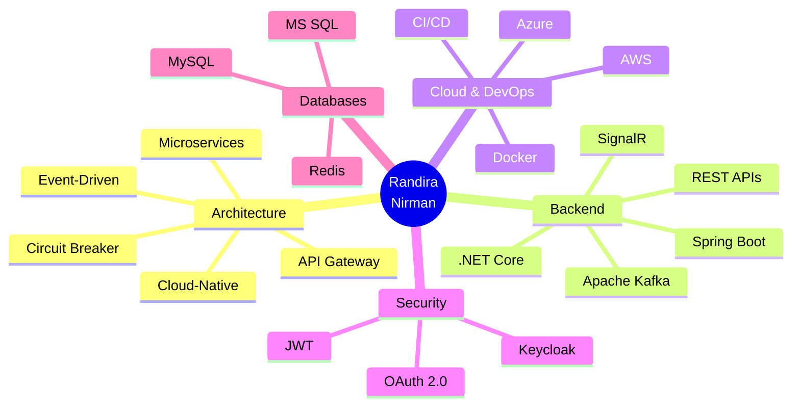

#  Hi, I'm Randira Nirman Weerasinghe

<div align="center">
  
  [](https://git.io/typing-svg)

</div>

<p align="center">
  
  
</p>

---

## 🚀 About Me

```typescript
const randira = {
    location: "Homagama, Sri Lanka 🇱🇰",
    education: "BSc (Hons) IT @ University of Moratuwa",
    currentYear: "3rd Year",
    role: "Software Engineering Intern",
    passion: "Building scalable, high-performance solutions",
    mindset: "Always learning, always building",
    
    architecture: ["Microservices", "Event-Driven", "Cloud-Native"],
    
    workingOn: {
        project: "FitLink Mobile App",
        description: "Connecting trainers with clients",
        tech: ["Spring Boot", "React Native", "Kafka", "OAuth 2.0"]
    },
    
    askMeAbout: ["Backend Development", "Microservices", "Cloud Architecture", "System Design"],
    
    funFact: "I don't just write code, I architect solutions 🏗️"
};
```

---

## 💼 Professional Experience

### 🏦 Spring Boot Developer @ JP Morgan Chase & Co.
**Virtual Internship | 2024**
- Enterprise-level Spring Boot development
- Financial technology solutions
- Large-scale system architecture

---

## 🛠️ Tech Stack

<div align="center">

### **Languages**


### **Backend & Frameworks**


### **Frontend**


### **Databases & Caching**


### **Cloud & DevOps**


### **Security & Architecture**


### **Development Tools**


</div>

---

## 🏆 Featured Projects

### 🎓 [LearnSphere LMS](https://github.com/randiranirman) 
**Team Leader & Backend Developer** | .NET Core • React • Azure • Redis • SignalR

> Learning Management System tailored for Sri Lankan education system

**🌟 Key Highlights:**
- 🏗️ **Microservices Architecture** with Azure cloud deployment
- ⚡ **Redis Caching** for optimal performance
- 🔔 **Real-time Notifications** using SignalR
- 🔒 **JWT Authentication** with multi-role system
- 🚦 **Rate Limiting** & background processing
- 📊 In-memory task queue for concurrent requests

**Tech:** `.NET Core` `React` `MS SQL Server` `Redis` `Azure` `SignalR` `JWT`

---

### 🔐 [Scalable Product API](https://github.com/randiranirman)
**Solo Backend Developer** | Spring Boot • Keycloak • Spring Cloud

> Fault-tolerant microservices API with enterprise-grade security

**🌟 Key Highlights:**
- 🛡️ **Circuit Breaker Pattern** for fault tolerance
- 🚪 **API Gateway** with Spring Cloud Gateway
- 🔐 **Keycloak Integration** for security
- 🌐 **Resilience Patterns** for high availability
- 📡 **Spring Feign** for service communication

**Tech:** `Spring Boot` `Keycloak` `Spring Cloud Gateway` `Circuit Breaker` `Feign`

---

### 💊 [Medicare Online Store](https://github.com/randiranirman)
**Full-Stack Developer** | Freelance Project

> E-commerce platform for medical supply business

**🌟 Key Highlights:**
- 💳 **Payment Gateway Integration**
- 📁 File-based data management
- 🔒 Session-based authentication
- 🛒 Complete e-commerce functionality
- 💼 Real-world business solution

**Tech:** `Java Servlets` `JSP` `Tailwind CSS` `Session Management`

---

### 💪 [FitLink Mobile App](https://github.com/randiranirman) 🚀 *Ongoing*
**Team Leader & Full-Stack Developer** | Spring Boot • React Native • Kafka

> Connecting personal trainers with clients for real-time fitness tracking

**🌟 Key Highlights:**
- 📱 **React Native Expo** mobile application
- 🔄 **Event-Driven Architecture** with Apache Kafka
- 🤖 **AI-powered** trainer certification approval
- 💳 Integrated payment service
- 🔔 Real-time notification system
- 🔐 **OAuth 2.0** & JWT authentication
- 📊 Real-time data tracking

**Tech:** `Spring Boot` `React Native` `Apache Kafka` `OAuth 2.0` `NativeWind`

---

## 📊 GitHub Statistics

<div align="center">
  
  
</div>

<div align="center">
  
</div>

<div align="center">
  
</div>

---

## 🏅 Certifications & Achievements

<table align="center">
  <tr>
    <td align="center">
      
    </td>
    <td align="center">
      
    </td>
  </tr>
</table>

### 🎯 Competition Participations
- **CodeRush 2024** - Participant
- **Idealize 2023** - Participant  
- **Idealize 2025** - Participant

---

## 🎯 Core Competencies

<div align="center">



</div>

---

## 📈 Contribution Activity

<div align="center">
  
[](https://github.com/randiranirman)

</div>

---

## 🤝 Let's Connect & Build Something Amazing!

<div align="center">

[](https://linkedin.com/in/randira-nirman-weerasinghe)
[](mailto:randiranirman20011210@gmail.com)
[](https://github.com/randiranirman)
[](tel:+94774003180)

</div>

---

<div align="center">

### 💡 *"Building the future, one commit at a time"*


</div>

---

<div align="center">
  
</div>

<div align="center">
  
**⭐ If you find my work interesting, consider starring my repositories! ⭐**

</div>
